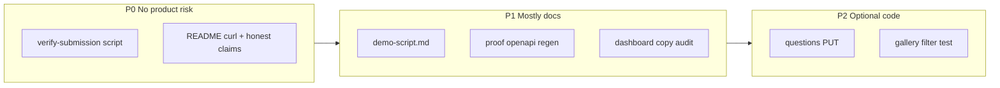

# Bridge gaps to maximize DOGFOOD score

## Operating rule: do not break what works

Every change must pass the **P0 gate** before merge. Prefer **additive** work (scripts, tests, docs, small API surfaces) over refactors of [`rbac.py`](src/api/app/rbac.py), [`judging.py`](src/api/app/routers/judging.py) scores paths, [`seed.py`](src/api/app/seed.py), or [`extended.py`](tests/acceptance/extended.py) vote checks unless fixing a proven bug.

**Frozen behaviors (do not “improve” without explicit reason + tests):**

| Behavior | Why judges care | Guard |
|----------|-----------------|--------|
| Peer `GET …/scores?judge=<peer>` → **403** | Official T2; #1 integrity failure mode | [`test_acceptance_paths.py`](tests/api/test_acceptance_paths.py), `run.py` |
| Peer score by UUID → **404** | No existence oracle | [`test_isolation.py`](tests/api/test_isolation.py), extended T2 |
| Sample Hack deadline POST → **403** | Official T1 | `run.py`, [`ensure_open`](src/api/app/routers/projects.py) |
| Gallery 40 projects, no `prj_41` | Fixture duplicate story | [`test_gallery_hides_the_duplicate`](tests/api/test_acceptance_paths.py) |
| Extended quadratic ballot check | Sample seed `vote_mode=quadratic` | [`extended.py`](tests/acceptance/extended.py) T3 branch |
| Demo tokens in [`.dogfood.toml`](.dogfood.toml) | Checker never logs in | [`seed.py`](src/api/app/seed.py) `DEMO_TOKENS` |

**Change discipline:** smallest diff; one concern per PR; after any touch to `votes.py`, `judging.py`, `rbac.py`, or `seed.py`, run full `pytest tests/api` + P0 gate on Docker `:8080`.

---

## Current position (verified in-session)

| Area | Status |
|------|--------|
| Official [`spec/run.py`](spec/run.py) | **7/7 PASS** on `:8080`; **T1+T2 verified** |
| Peer scores | [`list_scores`](src/api/app/routers/judging.py) L299–305: `may_read_judge` → 403 for peer ref |
| Fixture | [`test_fixture_exhaustive.py`](tests/api/test_fixture_exhaustive.py) — 30 judges, peer 403, constant rater, duplicate |
| Extended | **21/21** (not official) |
| Demo video | **Deferred** — you will add later; [`docs/demo-script.md`](docs/demo-script.md) supports recording when ready |

**Scoring lens:** 40% tiers/correctness, 25% judging integrity, 20% adoptability, 15% quality, bonuses for ties.



---

## P0 — Regression gate (no feature work)

### Work item A: `scripts/verify-submission.ps1` (and optional `.sh`)

**What changes:** New script only. No application code.

**Why:** Today verification is tribal knowledge (`run.py`, extended, pytest). A single entry point reduces “we fixed X and forgot run.py” before freeze.

**How it improves:** Repeatable pre-commit ritual; judges cloning the repo can reproduce reports the same way you did.

**Technical detail:**

1. Assert `http://localhost:8080/health` or gallery 200 (fail fast if stack down).
2. `python spec/run.py .dogfood.toml` → stdout to `acceptance-report.txt` (user redirects or script writes).
3. `python tests/acceptance/extended.py .dogfood.toml` → `acceptance-report-extended.txt`.
4. `src/api/.venv/Scripts/python.exe -m pytest tests/api/test_acceptance_paths.py -q` — **only** the seven checker-parity tests, fast.

**Why not full 167-test suite in gate:** Speed for frequent runs; full `pytest tests/api` remains mandatory after any API edit.

**Risk:** None to runtime. Script must not pipe `app.proof` through `head` (breaks generator).

---

### Work item B: README peer-score curl (documentation only)

**What changes:** [`README.md`](README.md) — one subsection under “Verify judging isolation”.

**Why:** Brief and organizers explicitly say UI hiding is not isolation; showing curl matches how `run.py` thinks.

**How it improves:** Adoptability (20%) + integrity narrative without code churn.

**Technical detail — exact check mirrors `run.py`:**

```http
GET /v1/events/sample-hack-2026/scores?judge=jdg_24
Cookie: portal_session=demo_jdg_b_44de3e
→ expect 403
```

Point readers to implementation: [`Actor.may_read_judge`](src/api/app/rbac.py) and [`list_scores`](src/api/app/routers/judging.py) — organizers may read any judge; judges only self.

**Risk:** None.

---

### Work item C: Honest tier wording (documentation only)

**What changes:** README already notes run.py T3/T4 gap; ensure it stays accurate after any claim change.

**Why:** Overclaiming is penalized; under-explaining extended suite wastes tie-break credit.

**Risk:** None.

---

## P1 — Judge-visible fixture story (minimal or zero code)

### Work item D: `docs/demo-script.md` (for your video later)

**What changes:** New markdown shot list only. **Video recording is out of scope for implementation** — you add the video later using this script.

**Why:** [`context/deliverables.md`](context/deliverables.md) requires a 5-minute lifecycle video; script prevents rambling and ensures fixture awkward cases appear on screen.

**How it improves:** When you record, one take covers scoring criteria: adoptability + integrity + tiers.

**Technical beats (map to existing routes):**

| Minute | Event | API / UI | Proves |
|--------|-------|----------|--------|
| 0–1 | Boot | `docker compose up`, boot logins | One command, seeded fixture |
| 1–2 | Sample Hack | `GET /projects` no auth | T1 gallery |
| 2 | Sample Hack | `POST /projects` as participant | T1 deadline 403 |
| 2 | Sample Hack | curl peer scores | T2 isolation |
| 3 | Sample Hack | Organize → Overview `GET /dashboard` | `constant_raters`, `duplicates`, `coverage.histogram` |
| 3–4 | Sample Hack | Results normalization + rank chart | Bonus 1 / JUDGING.md |
| 4–5 | Playground | create → team invite → draft → submit → assign → judge → publish | Full lifecycle [`test_lifecycle.py`](tests/api/test_lifecycle.py) |
| optional | Sample Hack | Mailpit voting link, quadratic credits | T3 email-gated + quadratic seed |

**Risk:** None.

---

### Work item E: Organizer UI audit (copy-only preferred)

**What changes:** Read [`GET /dashboard`](src/api/app/routers/judging.py) response shape vs Organize → Overview components ([`src/web/app/events/[slug]/organize/`](src/web/app/events/[slug]/organize/)). **Only** fix labels/help text if API fields exist but UI misnames them (e.g. “constant rater” vs `integrity.constant_raters`).

**Why:** Judges opening Sample Hack should see `jdg_07` and Dry Harbour duplicate without reading JSON.

**How it improves:** Judging integrity perception; no new backend logic.

**Do not:** Rework dashboard queries or polling unless a field is missing — that risks perf/regression.

**Verification:** Manual compare to [`test_coverage_constant_rater_and_duplicate`](tests/api/test_fixture_exhaustive.py) expectations.

**Risk:** Low if copy-only; medium if React data wiring changes — run gate after.

---

### Work item F: Regenerate bonus artifacts

**What changes:** Re-run generators; commit [`docs/normalization-proof.md`](docs/normalization-proof.md), [`docs/pairwise.md`](docs/pairwise.md), [`docs/openapi.json`](docs/openapi.json) if output differs.

**Why:** Stale proof docs contradict live `judging_math.py` / OpenAPI after edits.

**How it improves:** Bonus tie-break credibility; API First bonus stays aligned with [`test_api_first.py`](tests/api/test_api_first.py).

**Technical detail:**

- From `src/api`: `python -m app.proof` (allow ~1–2 min; no stdout truncation).
- `python -m app.pairwise_proof`
- `curl -s http://localhost:8000/openapi.json` → `docs/openapi.json`

**After:** `pytest tests/api/test_normalization.py tests/api/test_pairwise.py tests/api/test_api_first.py -q`

**Risk:** Low — docs only unless OpenAPI drift breaks `test_api_first` (fix by updating web calls or spec, not by weakening test).

---

## P2 — Optional gaps (only if P0 green; isolated PRs)

### Work item G: Custom organizer questions

**Gap today:** [`CustomQuestion`](src/api/app/models.py) + [`save_project`](src/api/app/routers/projects.py) accepts `answers[]`, but organizers cannot define questions via API/UI ([`events.py`](src/api/app/routers/events.py) has no question routes).

**What changes (proposed):**

| Layer | File | Change |
|-------|------|--------|
| Schema | [`schemas.py`](src/api/app/schemas.py) | `QuestionIn`, extend `EventDetail` with `questions[]` |
| API | [`events.py`](src/api/app/routers/events.py) | `PUT /v1/events/{id}/questions` — organizer, replace-all list; audit `event.questions` |
| Views | [`views.py`](src/api/app/views.py) | Include questions in `event_detail` |
| Web | Organize settings + [`submission-editor.tsx`](src/web/app/events/[slug]/submit/submission-editor.tsx) | Render prompts; POST answers on save |
| Test | New `test_custom_questions.py` | Required question blocks `submit` until answered |

**Why:** Closes T1 gap vs [Devpost custom fields](https://help.devpost.com/article/126-know-your-submission-steps) without touching judging.

**How it improves:** Adoptability + completeness; importers unchanged.

**Why this is safe:** New route + UI section; **does not modify** `list_scores`, assignment, or seed importer.

**Submit validation:** On `submit_project`, if `question.required` and no `CustomAnswer`, 422 — mirrors existing title/summary checks.

**Defer path:** If timeboxed, README one line: “Custom answers supported on save; organizer question editor ships next” — no half-broken UI.

**Risk:** Medium — new surface area; must run full pytest + gate.

---

### Work item H: Gallery filter tests

**What changes:** New [`tests/api/test_gallery_filters.py`](tests/api/test_gallery_filters.py) only, using `seeded` fixture client.

**Why:** [`gallery()`](src/api/app/routers/projects.py) implements `q`, `track`, `tag` but only manual smoke was done.

**How it improves:** Prevents accidental filter regression when editing `projects.py`.

**Tests (concrete):**

- `GET …/projects?q=Quiet` → exactly projects whose title/summary/description/team/tags contain needle (≥1).
- `GET …/projects?track=<slug>` → all results have matching track slug.
- `tag=` — only if a fixture project has `tech_tags` in DB; else set tag on Playground in test setup via API save (isolated event), **not** mutating Sample Hack fixture rows.

**Do not:** Change `gallery()` unless test fails for a real bug.

**Risk:** Very low.

---

### Work item I: Adoptability docs + Reviewed lines

**What changes:** README “Production” checklist; `Reviewed: name date` on [`JUDGING.md`](JUDGING.md), [`THREAT-MODEL.md`](THREAT-MODEL.md) after human skim.

**Why:** [`THREAT-MODEL.md`](THREAT-MODEL.md) already lists honest gaps (demo sessions, no CAPTCHA); README makes ops actionable.

**How it improves:** 20% adoptability; bonus threat model credibility.

**Risk:** None.

---

## P3 — Explicit non-goals

Hosted CAPTCHA/email verify, gallery rate limits, refactoring normalization estimator, changing peer 404 semantics, editing `run.py`, fake acceptance output, large UI redesign.

---

## Execution order

1. P0 A + B (script + README) — zero product risk  
2. P1 D + F (demo script + regen artifacts)  
3. P1 E (UI audit, copy-only)  
4. P2 H (gallery tests)  
5. P2 G (custom questions) **only if** time and gate stays green  
6. **You:** record demo video from `docs/demo-script.md` before submission deadline  

---

## Success criteria

- P0 gate passes on clean `docker compose up` after every merge that touches `src/`.
- `acceptance-report.txt` remains 7/7, verified T1 T2.
- Peer curl documented and matches `run.py`.
- `test_fixture_exhaustive.py` still parametrizes all 30 judges with peer 403.
- Demo script exists; video deferred to you.
- Optional: custom questions E2E or explicit README deferral.
