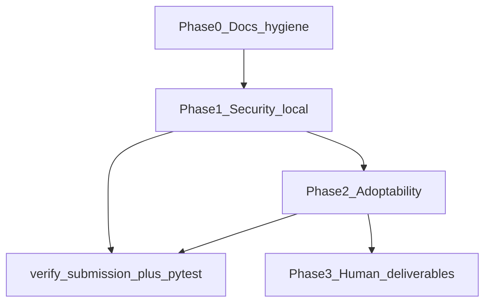

# Bridge remaining gaps (hackathon-safe)

## Guardrails (do not break)

Every phase ends with [`scripts/verify-submission.ps1`](scripts/verify-submission.ps1) on `docker compose up` (`:8080`) plus full `pytest tests/api` if `src/api` changed.

| Frozen behavior | Guard |
|-----------------|--------|
| Peer `GET …/scores?judge=<peer>` → **403** | [`test_acceptance_paths.py`](tests/api/test_acceptance_paths.py), `spec/run.py` |
| Peer score by UUID → **404** | [`test_isolation.py`](tests/api/test_isolation.py) |
| Sample Hack POST → **403** (closed deadline) | `run.py` T1 |
| Gallery 40 projects, no `prj_41` | [`test_gallery_hides_the_duplicate`](tests/api/test_acceptance_paths.py) |
| Demo tokens in [`.dogfood.toml`](.dogfood.toml) | [`seed.py`](src/api/app/seed.py), `DEMO_SESSIONS=true` compose default |
| No hosted runtime deps | [AGENTS.md](AGENTS.md) banned list |
| Do not edit [`spec/run.py`](spec/run.py) or invent reports | Honest `acceptance-report.txt` only |

`official-spec/` and `spec/` are already aligned on **fixtures + run.py**; prose-only `spec.md` sync is done. Optional paperwork: [`plans/13-kickoff-reconcile.md`](plans/13-kickoff-reconcile.md) diff file (Phase 0).

---

## Phase 0 — Hygiene (low risk, same day)

**Goal:** Judges see a complete story without touching judging maths or RBAC.

1. **Kickoff reconcile record** — Add [`context/kickoff-diff.md`](context/kickoff-diff.md) (template from plan 13): files received, “no schema delta vs importer”, suite map to `run.py` + [`tests/acceptance/extended.py`](tests/acceptance/extended.py). `Reviewed: pending` until you sign.
2. **Threat model accuracy** — Update [THREAT-MODEL.md](THREAT-MODEL.md) “Known gaps” when Phase 1 lands (remove or narrow “no email verify” / “no CAPTCHA” only for what we actually ship).
3. **SPEC-COMPLIANCE + DATA-MODEL** — One-line entries for email verification and any new columns ([`docs-sync` skill](.skills/docs-sync/SKILL.md)).
4. **CI parity** — [`.github/workflows/ci.yml`](.github/workflows/ci.yml) already runs compose + `run.py` + `extended.py`; add `pytest tests/api/test_acceptance_paths.py -q` in the acceptance job (fast checker-parity belt).

**Out of scope:** Changing tier claims in `.dogfood.toml` unless a new check truly passes.

---

## Phase 1 — Local security (your priority)

**Goal:** Close gaps listed in [THREAT-MODEL.md](THREAT-MODEL.md) without external CAPTCHA vendors. Reuse [`app/mailer.py`](src/api/app/mailer.py) (Mailpit) and existing rate limits.

### 1A — Registration email verification (Mailpit)

| Piece | Location | Behavior |
|-------|----------|----------|
| Schema | [`models.py`](src/api/app/models.py) `User` | `email_verified_at: datetime \| null` (nullable; existing rows treated unverified until verify or import) |
| Tokens | new table or signed one-time token pattern (match judge-invite style) | `email_verification` token, expiry, single use |
| Register | [`routers/auth.py`](src/api/app/routers/auth.py) | After create: send verify link via `send_mail`; session may still be issued (UX: banner “confirm email”) |
| Verify route | `GET` or `POST` `/v1/auth/verify-email/{token}` | Sets `email_verified_at`, audit `auth.verify_email` |
| Import/seed | [`importer.py`](src/api/app/importer.py) / [`seed.py`](src/api/app/seed.py) | Fixture and demo users **pre-verified** so `run.py` / extended never need Mailpit clicks |
| Voting gate | [`routers/votes.py`](src/api/app/routers/votes.py) | When `voting_access == authenticated` and event flag `require_verified_email` (default **true** for new events; Sample Hack seed unchanged or explicitly verified) → **403** with clear message if unverified |
| Web | register success + `/verify-email` page or toast; link target uses `PUBLIC_URL` | |
| Tests | new `test_email_verification.py` | register → mail not required in unit test if `send_mail` monkeypatched; ballot blocked until verified; seed users still vote |

**Why not block login entirely?** Judges cloning the repo must still use demo cookies and `password` logins without reading Mailpit unless they choose to test verify flow.

### 1B — Abuse resistance without hosted CAPTCHA

THREAT-MODEL currently says CAPTCHA needs a hosted service; we **replace that claim** with local mitigations:

| Control | Where | Notes |
|---------|--------|------|
| Honeypot field | Register + open-ballot forms (web + API ignores if `website` filled) | [`submission-editor`](src/web) pattern not needed; auth + votes |
| Minimum time | Register: reject if form submitted &lt; 2s after token issued (optional server-issued nonce) | Light bot friction |
| Stricter open voting copy | Organize → Settings | Warn when `open` + `quadratic` (already partially documented server-side) |

No reCAPTCHA, hCaptcha, or Turnstile.

### 1C — Optional: public read rate limit

If time remains in Phase 1: Redis limit on `GET /events/{id}/projects` (e.g. 120/min/IP), fail-open if Redis unset (dev SQLite), fail-closed in compose (matches vote limits). Test one 429 in [`test_gallery_filters.py`](tests/api/test_gallery_filters.py) or new file.

**Phase 1 exit:** Full pytest + verify script; update THREAT-MODEL table row for authenticated voting.

---

## Phase 2 — Adoptability engineering (after security is green)

**Goal:** Address “no Alembic” and “pytest on SQLite” honestly, without breaking one-command boot.

### 2A — Alembic initial migration

Follow [`.skills/schema-defense/SKILL.md`](.skills/schema-defense/SKILL.md) and [plans/02-data-model-and-pipeline.md](plans/02-data-model-and-pipeline.md).

1. Add Alembic under `src/api/alembic/` with **one baseline revision** matching current models (including `email_verified_at` from Phase 1).
2. Boot path in [`main.py`](src/api/app/main.py): on Postgres, `alembic upgrade head` then seed; keep `create_all` only for SQLite tests OR generate migrations and use `create_all` in tests only.
3. Document upgrade path in README + [DATA-MODEL.md](DATA-MODEL.md): fresh install vs upgrade (export JSON still the escape hatch).
4. **Risk control:** Fresh `docker compose up` on empty volume is the acceptance test; never migrate Sample Hack fixture IDs.

### 2B — Postgres in CI (narrow)

Add optional job or step: run a **small** pytest subset with `DATABASE_URL=postgresql://…` (GitHub service container or `docker compose exec api pytest …`) covering concurrency-sensitive tests (team save lock, vote uniqueness). Do not duplicate all 171 tests unless cheap.

### 2C — Production compose overlay

`docker-compose.prod.yml` or documented env: `DEMO_SESSIONS=false`, `SESSION_SECRET` required — **default compose unchanged** for judges running the checker.

---

## Phase 3 — Human deliverables (cannot be automated)

| Item | Action |
|------|--------|
| **5-minute video** | Record from [`docs/demo-script.md`](docs/demo-script.md); include new verify-email beat only if shipped |
| **`Reviewed: name date`** | You add to [JUDGING.md](JUDGING.md), [THREAT-MODEL.md](THREAT-MODEL.md), [`context/kickoff-diff.md`](context/kickoff-diff.md) after skim |
| **Acceptance reports** | Re-run verify script before tag/submission; commit reports if you want judges to see latest timestamps |

---

## Explicit non-goals (still)

- Hosted identity, CAPTCHA SaaS, S3, SendGrid, OpenAI-in-product
- Editing `spec/run.py` or claiming T3/T4 in official report wording beyond “extended verifies”
- Peer 404/403 semantic changes, normalization refactors, large UI redesign ([plans/16-ux-redesign.md](plans/16-ux-redesign.md))
- “Fixing” `open` voting to true one-person-one-vote on the public internet without identity

---

## Suggested execution order (security-first)

1. Phase 0 kickoff-diff + CI acceptance_paths
2. Phase 1A email verification (API → seed/importer → votes → web → tests)
3. Phase 1B honeypot + copy
4. Phase 1C gallery rate limit (optional)
5. Gate
6. Phase 2A Alembic (single PR, heavy testing)
7. Phase 2B Postgres subset CI
8. Phase 2C prod overlay docs
9. Gate + you record video and Reviewed lines

**Success:** THREAT-MODEL gaps shrink with tests; `run.py` still 7/7 verified T1+T2; extended suite still green; adoptability narrative strengthens without violating offline/local rules.
