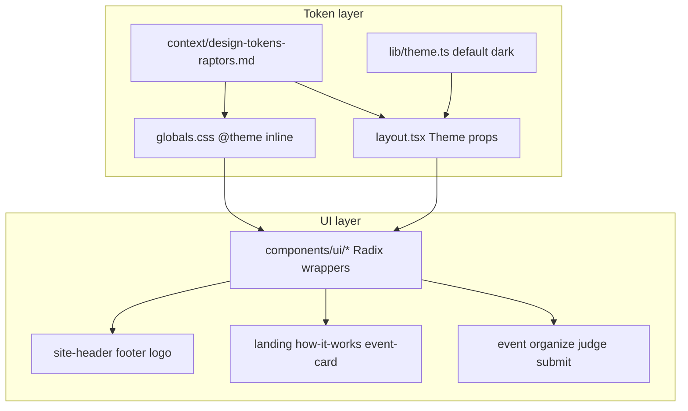

# Raptors-inspired UI redesign

## What to change in [plans/16-ux-redesign.md](plans/16-ux-redesign.md)

The plan file is **out of date** in three ways and needs an edit pass before implementation:

| Section | Issue | Update |
| --- | --- | --- |
| **Status (2026-09-25)** | Claims full Radix rebuild and axe pass; problems table still reads like pre-redesign | Reframe: **Phases A–B done** (compact event bar, work home, lifecycle rail, Radix primitives). Remaining work is **Phase C — visual identity** (this effort). |
| **Direction** | Locks `accentColor="lime"`, `grayColor="olive"`, dinosaur as primary brand | Replace with **Raptors-inspired tokens** (dark default, new accent/gray, editorial typography). Keep dinosaur art **recolored/masked** per your choice—not removed. |
| **Checks** | No visual regression for rebrand | Add: re-run axe on 15 screens after token swap; snapshot 390/1440; `npm run build`; `tests/api/test_api_first.py` unchanged. |
| **Reviewed** | `pending` | After you approve the design doc, `Reviewed: hatif03 <date>`. |

Do **not** reopen API or organizer tab structure unless contrast audits fail—Phase C is **tokens + chrome + marketing surfaces**, not a second layout rewrite.

---

## Design reference: [raptors.dev](https://www.raptors.dev/)

Capture **measurable tokens** in a new doc (machine-readable, judge-friendly):

**[context/design-tokens-raptors.md](context/design-tokens-raptors.md)** (new)

Phase 0 (30–45 min, human + agent): open raptors.dev in DevTools and record:

- **Background stack**: near-black base, slightly lifted “panel” surfaces (their sections feel layered, not flat gray).
- **Text**: high-contrast headlines (large, tight tracking); body in softer gray; **section indices** (`01`, `02`) in mono or small caps—mirror on portal section labels (landing, how-it-works, footer).
- **Accent**: one warm or electric highlight used sparingly on links/CTAs (not lime everywhere)—map to a single Radix `accentColor` (candidate: `amber`, `orange`, or `crimson` after side-by-side comparison with their primary buttons/links).
- **Gray ramp**: switch from `olive` to **`gray` or `mauve`** for neutral UI chrome (closer to editorial dark sites).
- **Motion**: restrained; optional **marquee** only on marketing footer (homage to their “Let’s Talk” band)—**off** on judge/submit/organize task screens (keep plan 16 Amicro rules).
- **Event cards**: poster-like tiles (strong title, track/tag pill, subtle border)—inspired by their event carousel, using **your** event data only (no copying their poster images).

**Legal / adoptability**: inspiration only—no Raptors logo, CIC copy, or scraped assets. Footer may say “Built for Dogfood 2026 · inspired by Hackathon Raptors” with link, not impersonation.

---

## Architecture (unchanged vs plan 16)

- **Tailwind + Radix Themes** stay; only `Theme` props and CSS variables change ([`src/web/app/layout.tsx`](src/web/app/layout.tsx), [`src/web/app/globals.css`](src/web/app/globals.css)).
- **Accent discipline** from [`src/web/components/ui/button.tsx`](src/web/components/ui/button.tsx) stays: primary = accent; secondary/ghost = gray.

---

## Implementation phases

### Phase 0 — Token doc + defaults

1. Write [context/design-tokens-raptors.md](context/design-tokens-raptors.md) with hex/Radix mapping table (bg, fg, muted, accent, danger, line, radius, shadows).
2. Set **dark default** in [`src/web/lib/theme.ts`](src/web/lib/theme.ts) (and `THEME_SCRIPT` first paint) while keeping toggle in [`src/web/components/theme-toggle.tsx`](src/web/components/theme-toggle.tsx).
3. Update [`src/web/app/layout.tsx`](src/web/app/layout.tsx): `accentColor`, `grayColor`, `panelBackground`, `radius`; update `viewport.themeColor` to match dark base.
4. Extend [`globals.css`](src/web/app/globals.css): optional `--font-display`, section-label utility (`.section-index`), toned-down `shadow-glow` (editorial, not lime glow).

### Phase 1 — Typography

1. Add a **display** face via `next/font` (e.g. **Syne** or **DM Sans**—pick whichever best matches raptors.dev computed `font-family` on `h1`).
2. Keep **Geist Sans/Mono** for UI and code ([`layout.tsx`](src/web/app/layout.tsx) already loads Geist).
3. Apply display font to: landing `h1`, page section titles, organizer console main headings—not every `text-sm` label (preserve density on task pages).

### Phase 2 — Chrome and logo

| File | Change |
| --- | --- |
| [`src/web/components/logo.tsx`](src/web/components/logo.tsx) | Mark + wordmark: darker panel, accent claw/grid (homage, not Raptors trademark) |
| [`src/web/components/site-header.tsx`](src/web/components/site-header.tsx) | Dark translucent bar; nav typography; optional mono “menu index” style on mobile |
| [`src/web/components/site-footer.tsx`](src/web/components/site-footer.tsx) | Raptors-adjacent footer: MIT/offline line + link to raptors.dev; optional subtle marquee band |
| Metadata | [`layout.tsx`](src/web/app/layout.tsx) `themeColor`, OG [`public/art/og.jpg`](public/art/og.jpg) re-export with new palette |

### Phase 3 — Marketing surfaces

| File | Change |
| --- | --- |
| [`src/web/components/home/landing.tsx`](src/web/components/home/landing.tsx) | Editorial hero: section index `01`, display headline, recolor **dino** via CSS `filter`/overlay + mask tuned for dark base ([`dino-art.tsx`](src/web/components/dino-art.tsx)) |
| [`src/web/components/participant/auth-shell.tsx`](src/web/components/participant/auth-shell.tsx) | Same dino treatment on login/register split panel |
| [`src/web/components/public/event-card.tsx`](src/web/components/public/event-card.tsx) | Poster card: border, phase pill, title scale |
| [`src/web/components/public/how-it-works.tsx`](src/web/components/public/how-it-works.tsx) | Section `02` styling; reduce mono-on-muted contrast issues |
| [`src/web/app/not-found.tsx`](src/web/app/not-found.tsx) | Align with dark editorial + dino |

### Phase 4 — Task pages (token-only pass)

Sweep **className** uses of hard-coded lime feel (`bg-accent` on non-primary elements):

- [`lifecycle.tsx`](src/web/app/events/[slug]/organize/lifecycle.tsx), [`overview.tsx`](src/web/app/events/[slug]/organize/overview.tsx), [`results.tsx`](src/web/app/events/[slug]/organize/results.tsx), gallery/judge/vote—replace decorative accent dots/bars with **gray + one accent** for current step only.
- Verify [`badge.tsx`](src/web/components/ui/badge.tsx) tone map still reads on dark (axe already fixed avatars—re-run).

No route or API changes.

### Phase 5 — Docs sync

- Update [plans/16-ux-redesign.md](plans/16-ux-redesign.md) Direction + Status + Phase C checklist.
- Short pointer in [README.md](README.md) screenshots section (if any) or “UI” one-liner: dark editorial theme, Raptors-inspired.
- Run **docs-sync** skill checklist: context doc is source of truth for colors/fonts.

---

## Verification (same bar as plan 16)

| Check | Command / action |
| --- | --- |
| Build | `cd src/web && npm run build` |
| API contract | `pytest tests/api/test_api_first.py` |
| Acceptance | `scripts/verify-submission.ps1` (unchanged) |
| a11y | axe-core CDP pass on 15 screens (light **and** dark after rebrand) |
| Visual | 390px + 1440px screenshots of `/`, `/login`, gallery, judge, organize overview, results |

---

## Out of scope (explicit)

- Copying Raptors logos, event posters, or Webflow assets.
- Replacing Radix with another component library.
- New product features or API fields.
- Light-mode polish beyond “readable contrast” (dark is default; light remains supported).

---

## Suggested commit batches (when implementing)

1. `docs: Raptors design tokens and plan 16 phase C`
2. `feat(web): dark default theme and Radix token remap`
3. `feat(web): typography and marketing chrome`
4. `style(web): task-page accent discipline and og art`
